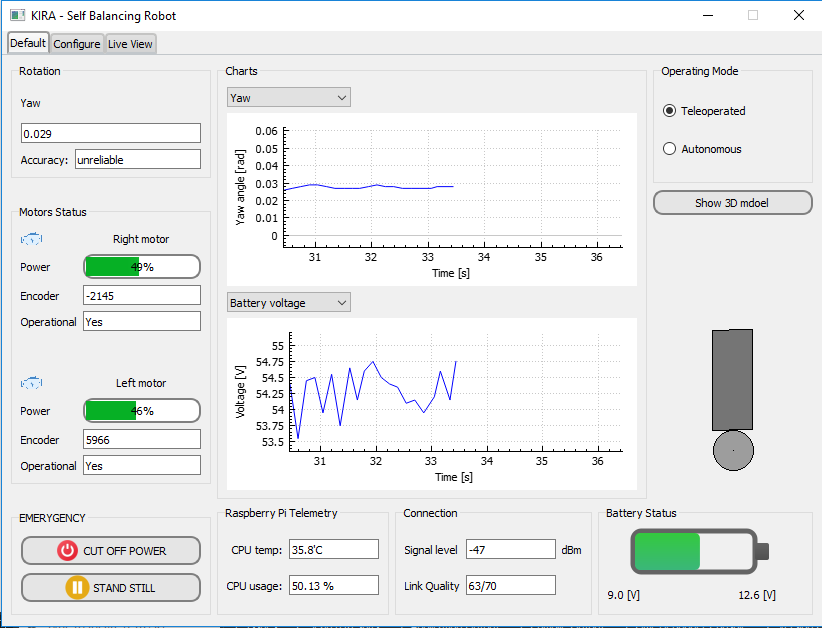
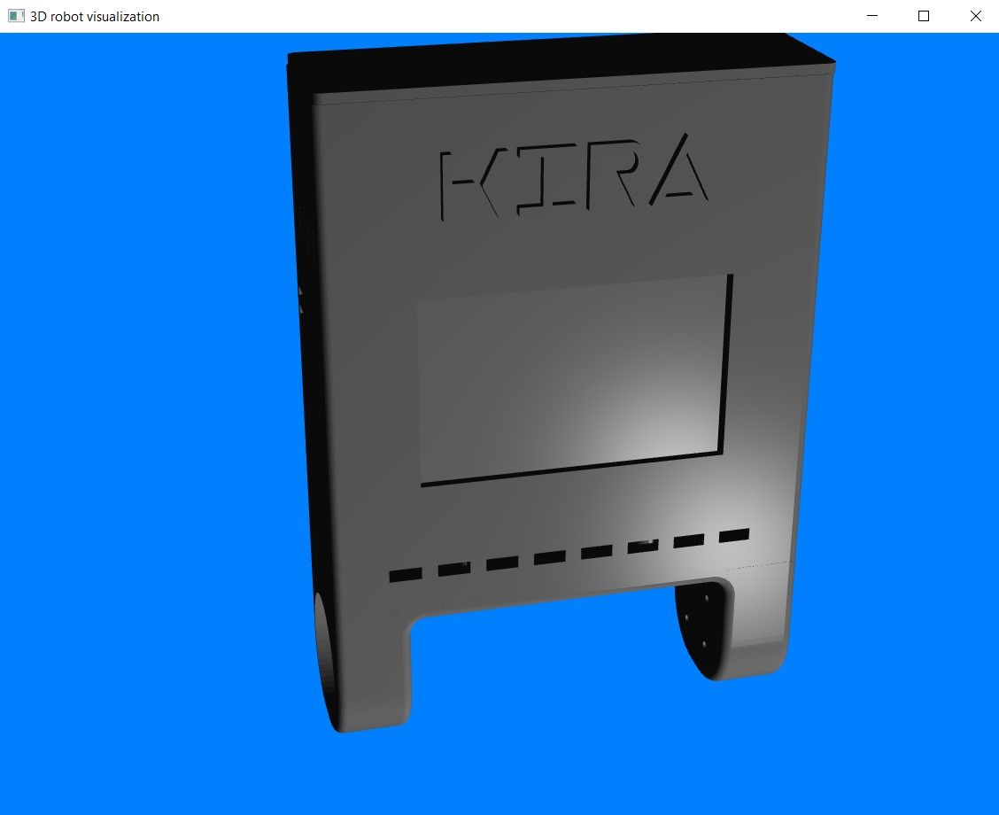
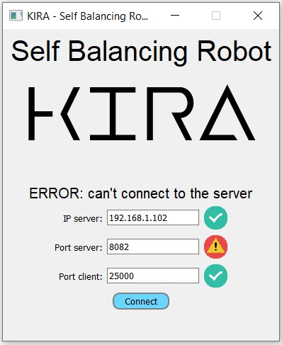

# Qt_balancing_robot
Aplikacja pozwalająca na śledzenie parametrów robota balansującego w czasie rzeczywistym.
Niekótre możliwości aplikacji:
- śledzenie m.in. napięcia baterii, siły sygnału,
- wizualizacja 2D odchylenia robota od pionu,
- prezentacja napięcia baterii w formie znanej z telefonów komórkowych,   
- wizualizacja 3D obudowy robota  
- ekran łączenia z robotem 
  
Zdjęcia pokazujące działanie aplikacji  

  
Dodatkowo dodano dokumentację wygenerowaną przy użyciu Doxygena.  
Współtwórca odpowiedzialny za łączenie się z raspberry: Mateusz Adamczyk
